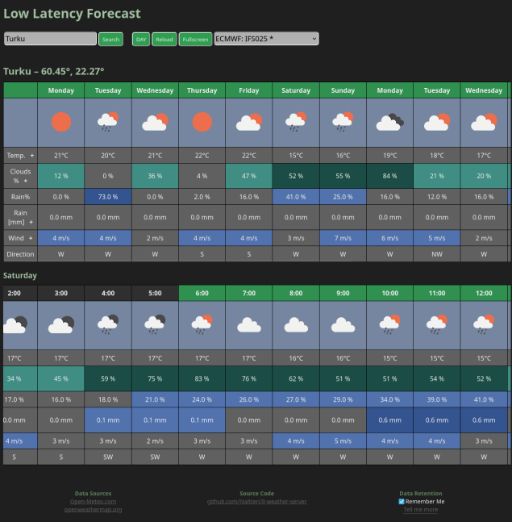

# Low Latency Weather Server

A weather forecast web app with a **Go** backend.

## Description

A fast, light weight, all-in-one web app to provide weather forecasts. Some weather forecast services provide web pages that are heavy and slow to load. LL-Weather-Server is as light and lean as can be. The backend is done with **Go**. The primary source for data is [openweathermap.org](https://openweathermap.org/api). The data is cached in the backend to reduce required API calls and to speed up responses.



## Requirements

- [**Go**](https://go.dev/) 1.19 or newer

## Planned and Completed Features

- [x] Light weight
- [x] Weather data caching
- [x] Search for cities
- [x] Configfile (JSON)
- [x] Expand day previews to show detailed forecast for the day
- [x] Show weather preview for noon and night (22:00), for astronomy purposes
- [ ] Seamless update of data, but cached data for lighting fast initial response
- [x] Show at a glance
- [ ] Customization
- [ ] Location and customization in URL for easy bookmarking
- [ ] Dockerized
- [ ] Aggregate multiple data sources
- [ ] Weather Map
- [ ] Implement cache size limiting
- [ ] Tests

## Configuration

Config files `config.json` and `api_keys.json` should be placed in the server root directory.

| Desc. | filename | Notes |
| -- | -- | -- |
| Configfile | `config.json` | Server configuration |
| Keyfile | `api_keys.json` | Should contain your API keys for data sources |

### Example config

#### config.json
```json
{
  "ORIGIN_URL": "http://localhost",
  "SERVER_PORT": "3000",
  "ENABLE_TLS": false,
  "CERT_FILE": "",
  "PRIVATE_KEY_FILE": "",
  "UNITS": "metric",
  "COUNTRY_CODE": "FI",
  "CACHE_AGE": 6,
  "CACHE_SIZE": 200
}
```

| Key | default | Description |
| -- | -- | -- |
| `ORIGIN_URL` | `"http://localhost"` | Your server address |
| `SERVER_PORT` | `3000` | Port number |
| `ENABLE_TLS` | `false` | Use HTTPS |
| `CERT_FILE` | `""` | Certificate file |
| `PRIVATE_KEY_FILE` | `""` | TLS Private key file |
| `UNITS` | `"metric"` | metric/imperial/kelvin |
| `COUNTRY_CODE` | `"FI"` | [ISO 3166 country code](https://en.wikipedia.org/wiki/List_of_ISO_3166_country_codes) |
| `CACHE_AGE` | 6 | Max age in hours |
| `CACHE_SIZE` | 200 | Max size |

`"COUNTRY"` Limits the city name searches to a single country. Reduces ambiguity. You can set it to empty to lift this restriction, but you may be unable to find some cities this way.

#### api_keys.json

```json
{
    "OPENWEATHERMAP": ""
}
```

| Key | Description | Where to Get |
| -- | -- | -- |
| `OPENWEATHERMAP` | **Free** API key to Openweathermap.org/api | [openweathermap.org](https://openweathermap.org/price) |

#### HTTPS/TLS

To enable HTTPS, you need a valid certificate file and private key file.
Set `"ENABLE_TLS": true` and give the cert and private key file names to `"CERT_FILE":` and `"PRIVATE_KEY_FILE":` respectively.
You can get these from [Let's Encrypt](https://letsencrypt.org/getting-started/).

## Running server

As long as [**Go**](https://go.dev/) is installed and you have created the required [configuration files](#configuration), you can run the server with this command:
```
go run .
```

### Build

For long term deployments you should build the server. You should also get a [TLS certificate]((#httpstls)) and enable [HTTPS/TLS](#httpstls)

#### Build:
```
go build
```

and then run the generated executable `ll-weather-server`

## Data Sources

The server uses [JValtteri/weather](https://github.com/JValtteri/weather/) API Libraries to fetch weather data.
